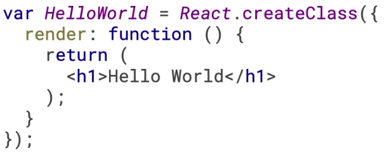
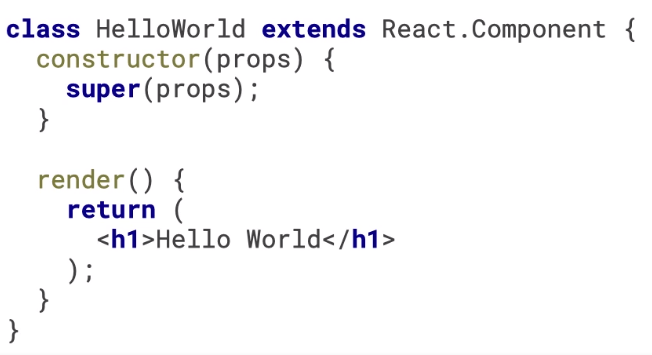
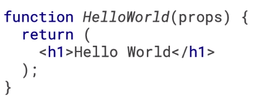
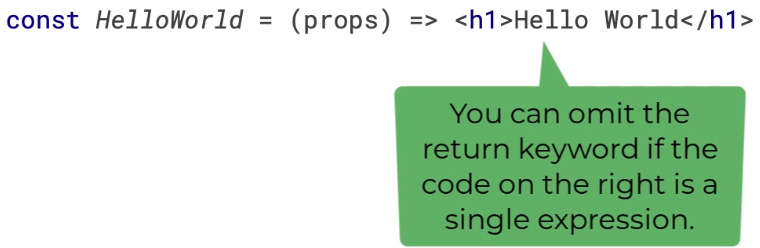
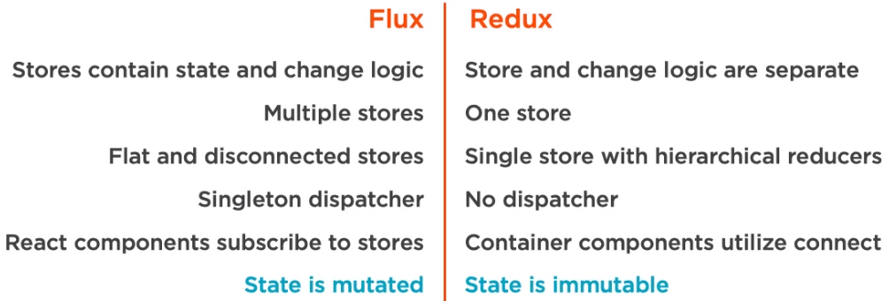
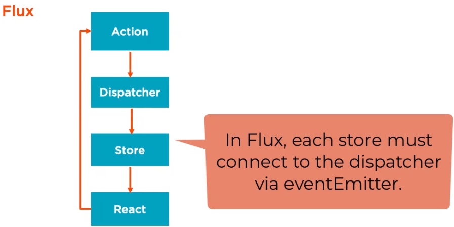
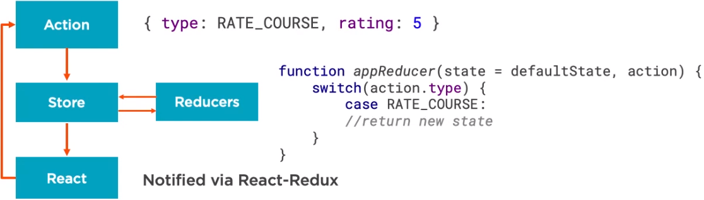
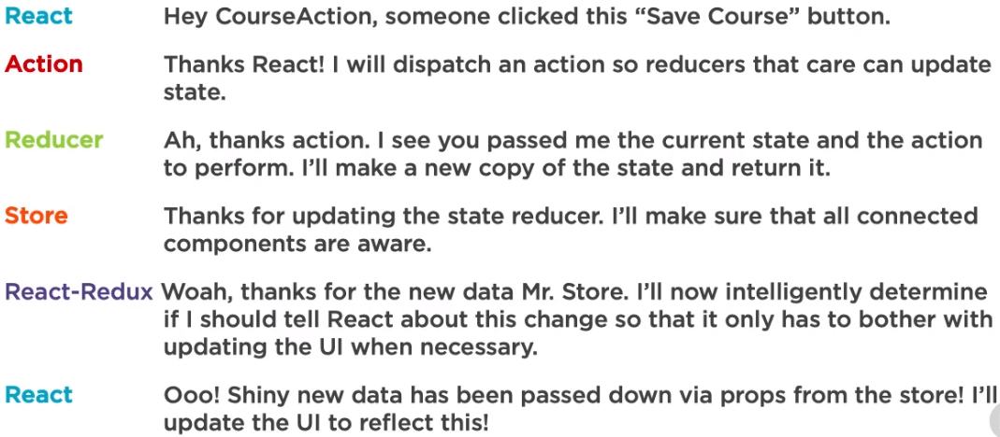

# Ways to create components
1. createClass

2. ES class

3. Function

4. Arrow function


## Benefits of functional components
1. Easier to understand
2. Avoid `this` keywork
3. Less trandpiled code (when passed through babel)
4. High signal=to-noise ratio
5. Enhanced code completion/intellisense
6. Easy to test
7. Performance
8. Class may be removed in future


#


## When is Redux Helpful
1. Complex data flow
2. Inter-component communication
3. Non-hierarchical data
4. Many actions
5. Same data used in many places

## Redux Principles
1. One immutable store
2. Action triggers are used for changes
```
// SUBMIT_CONTACT_FORM is an action creator
{
    type: SUBMIT_CONTACT_FORM, 
    message: "Hi."
}
```
3. Reducers update state

## Flux and Redux: similarities
1. Unidirectional data fllow
2. Actions define state change
3. Both use stores for data(redux has a single store while flux has multiple)

## Flux and Redux: differences





### Redux store
```
let store = createStore(reducer);

// redux api functions
store.dispatch(action)
store.subscride(listener)
store.getState()
replaceReducer(nextReducer)
```

## A Chat With Redux


## Initial Redux Setup
1. Create action
2. Create reducer
3. Create root reducer
4. Configure store
5. Instantiate store
6. Connect component
7. Pass props via connect
8. Dispatch action

## Add Feature
1. Create action
2. Enhance reducer
3. Connect component
4. Dispatch action

For large datasets use id to reference your data
```
const cources = {
    1: {is:1, title: "course 1,"},
    2: {is:2, title: "course 2,"}
}
```